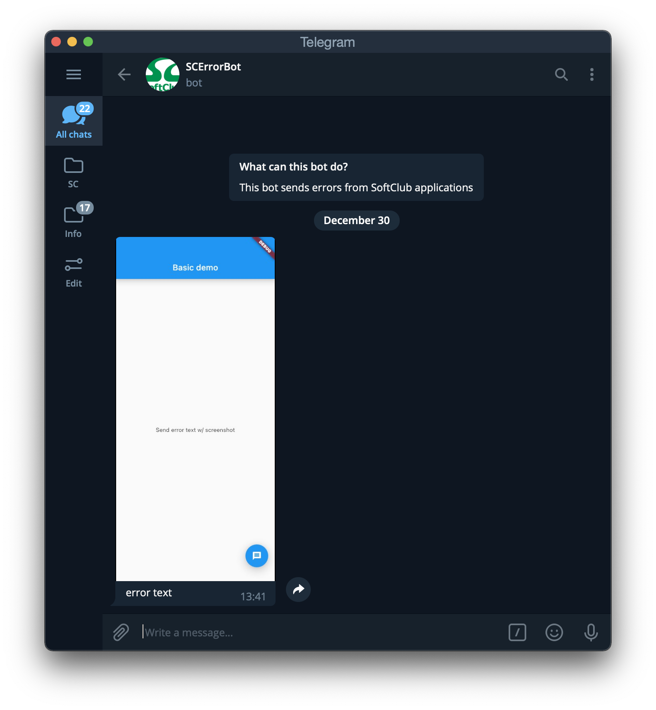

# sc_error_manager

SC Error manager which sends errors w/ screenshot to Telegram

## Usage

To use this plugin, add `sc_error_manager` as a dependency in your pubspec.yaml file

## Getting Started

Init static constructor `SCErrorManager` before `runApp` if you would like to use w/o screenshot

``` dart
void main() {
  SCErrorManager(
    telegramBotApiKey: "apikey",
    chatId: 12345678
  );
  runApp(MyApp());
}
```

or wrap your app widget with `ScErrorWidget` if you would like to use w/ screenshot

``` dart
ScErrorWidget(
  telegramBotApiKey: "apikey",
  chatId: 12345678,
  child: MaterialApp(
    title: 'Flutter Demo',
    home: HomePage(),
  ),
);
```

Then invoke the static `sendMessage` method anywhere in your Dart code.

``` dart
SCErrorManager.sendMessage("error text");
```

Telegram message:



## License

MIT
